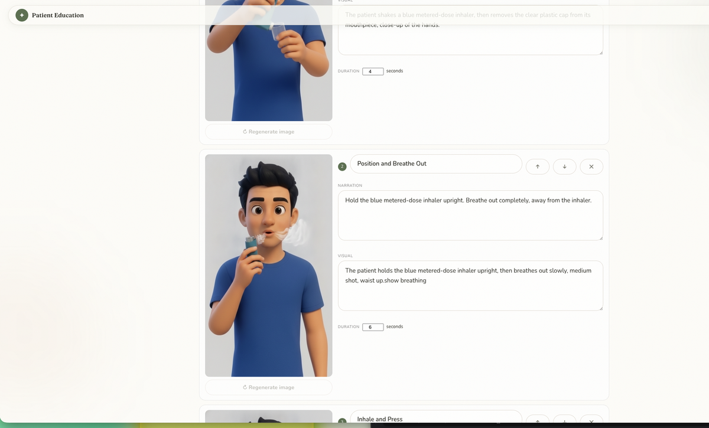
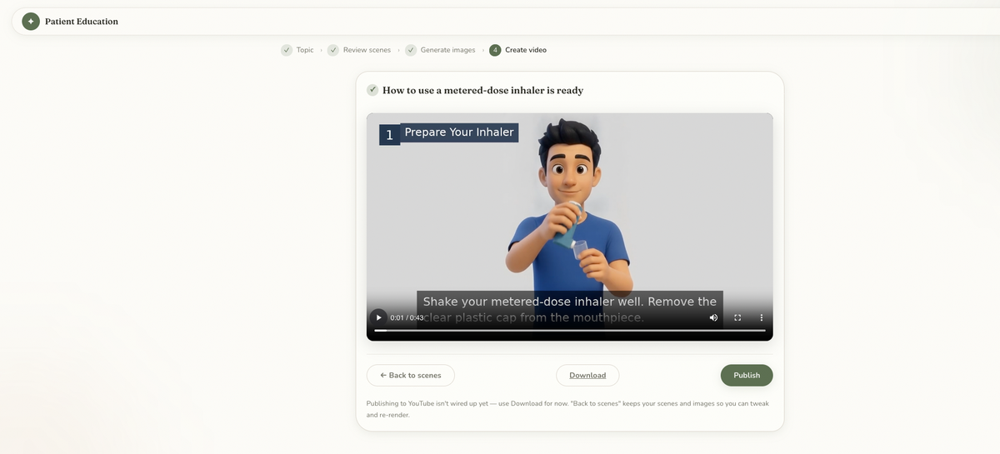

# Patient Education Video Generator

A doctor types in a topic and gets back a narrated, captioned video explaining it to patients.

I built this for my sister, who's a Doctor and kept explaining the same procedures over and over.
My main motive behind it was she is not technical so wanted to keep the UI as basic and user friendly 
and make the video generation as cheap as possible by adding manual approval gates everywhere so that
the amount of rework needed is less.


## How it works

Doctor types a topic like "how to use a metered-dose inhaler." Gemini turns that into a handful of
scenes — a title, the narration, and a description of what should be on screen — and rewrites the
narration to a plain reading level, since it's meant for patients.

Then the doctor edits. Rewords the narration, reorder scenes, change how long each one is on screen. This
part is deliberately cheap: nothing expensive has run yet, so the doctor can fiddle as much as they want.

When the text is right, one click generates an illustration for each scene. Doctor looks at them and
regenerates any that missed. Only then does the video render — FFmpeg pans and zooms over the stills,
burns in captions and a step label, and mixes in the narration audio. Progress streams back to the
browser over SSE so the page isn't just frozen for a few minutes.





## Stack

| | |
|---|---|
| Frontend | React (Vite) |
| Backend | Spring Boot 3, Java 21 |
| Auth | Google OAuth with an email allowlist |
| Scene planning, translation, images | Gemini |
| Narration | Piper locally for English, Hindi, Malayalam, Telugu; Gemini TTS for Tamil |
| Rendering | FFmpeg |
| Optional paid path | Google Veo (animates each still) |
| Storage | None — job state in memory with a TTL, rendered files in temp storage |

## Some things I figured out along the way

**Keeping iteration cheap.** All the editing happens on text and stills. The render is one deliberate
click at the end. That way a video costs close to nothing to make, and the paid tier is something you
choose on purpose rather than trip into.

**A human approves every frame.** It's medical content, so the doctor reviews each image before
anything renders. The app also tracks which scenes they edited *after* their image was generated — the
Regenerate button only lights up for those, and if they try render with stale images it lists
exactly which scenes are out of date first.

**Character consistency was the hard part.** Every image is generated independently, so the same
"patient" kept drifting between scenes — different shirt, different face. Worse, on wider frames the
model would sometimes draw the same person twice, split down the middle of the image. I ended up with
a small fixed cast (patient, caregiver, doctor, nurse), each with a reference crop and a written
description that gets composed into every prompt, plus negative prompting against mirrored duplicates.
It's much better now, but not perfect — hence the regenerate button.

**Why it's on a plain VM.** I tried the obvious serverless options first. Cloud Run throttles CPU
once the HTTP response is sent, which starves a background render worker, and App Engine Standard
can't run the FFmpeg and Piper binaries at all. So the backend runs on a Linux VM with Tailscale
Funnel in front of it for HTTPS, and the frontend is static on Vercel.


## Languages

| Language | Voice | Engine |
|---|---|---|
| English | `en_US-kusal-medium` | Piper (local, free) |
| Hindi | `hi_IN-rohan-medium` | Piper (local, free) |
| Malayalam | `ml_IN-meera-medium` | Piper (local, free) |
| Telugu | `te_IN-padmavathi-medium` | Piper (local, free) |
| Tamil | `Kore` | Gemini TTS |

You pick the language before rendering. The narration gets translated, then synthesized with that
language's voice, and the video is rendered again — one audio track per video rather than a single
file you switch tracks in.

## Running it locally

You'll need Java 21 (I'm on Temurin 21.0.11), Node 26, Maven (wrapper's included), a Gemini API key,
a Google OAuth client ID, the Piper binary, and FFmpeg **built with `drawtext`** — check with
`ffmpeg -filters | grep drawtext`. Ubuntu's apt package has it; on macOS you may need a build with
`--enable-libfreetype`, which cost me an afternoon to work out.

**Piper voices.** Each voice is two files, an `.onnx` and its `.onnx.json`, and they have to sit next
to each other:

```bash
mkdir -p ~/piper-voices && cd ~/piper-voices
BASE="https://huggingface.co/rhasspy/piper-voices/resolve/main"
curl -L -O "$BASE/en/en_US/kusal/medium/en_US-kusal-medium.onnx"
curl -L -O "$BASE/en/en_US/kusal/medium/en_US-kusal-medium.onnx.json"
curl -L -O "$BASE/hi/hi_IN/rohan/medium/hi_IN-rohan-medium.onnx"
curl -L -O "$BASE/hi/hi_IN/rohan/medium/hi_IN-rohan-medium.onnx.json"
curl -L -O "$BASE/ml/ml_IN/meera/medium/ml_IN-meera-medium.onnx"
curl -L -O "$BASE/ml/ml_IN/meera/medium/ml_IN-meera-medium.onnx.json"
curl -L -O "$BASE/te/te_IN/padmavathi/medium/te_IN-padmavathi-medium.onnx"
curl -L -O "$BASE/te/te_IN/padmavathi/medium/te_IN-padmavathi-medium.onnx.json"
```

Tamil needs no download — it routes to Gemini TTS.

**Backend:**

```bash
cd patientEducation
export GEMINI_API_KEY=your-key
export PIPER_BIN=/path/to/piper
export PIPER_VOICE_EN=~/piper-voices/en_US-kusal-medium.onnx
export PIPER_VOICE_HI=~/piper-voices/hi_IN-rohan-medium.onnx
export PIPER_VOICE_ML=~/piper-voices/ml_IN-meera-medium.onnx
export PIPER_VOICE_TE=~/piper-voices/te_IN-padmavathi-medium.onnx
./mvnw spring-boot:run
```

**Frontend:**

```bash
cd frontend
npm install
echo "VITE_GOOGLE_CLIENT_ID=your-client-id" > .env.local
npm run dev
```

Add your email to `google.allowed.emails` in `application.properties` or the allowlist won't let you in.

### Config worth knowing about

| Property | What it does |
|---|---|
| `google.allowed.emails` | Who can sign in |
| `premium.emails` | Who can use the paid Veo path |
| `ffmpeg.pad-color` | Background beside non-16:9 images. `auto` samples the image's own edge colour |
| `ffmpeg.fill-mode` | `fit` shows the whole image and pads; `cover` fills the frame and crops |
| `ffmpeg.caption-languages` | Which languages burn captions (default `en`) |
| `image.gemini.aspect-ratio` | Leave empty for the model's natural framing |
| `video.veo.model` | Which Veo model the premium path uses |
| `VITE_API_BASE` | Backend URL in production; empty in dev since Vite proxies |

## What's not done

- **YouTube publishing is a stub.** The button's there and says so honestly. Download works.
- **RAG isn't built.** The plan was to ground scene planning against vetted medical sources before
  generating. Designed, not implemented.
- **The Veo path hasn't been live-tested.** It's wired end to end and follows Google's documented
  API, but I haven't run a successful paid render through it.
- **Captions are English-only**, for the font reasons above.
- **Nothing persists.** Job state is in memory, so a restart loses anything in flight.
- **Renders are slow on small machines.** FFmpeg is CPU-bound and the app needs real RAM — I spent a
  while on a 1 GB VM watching renders get OOM-killed before working that out.
